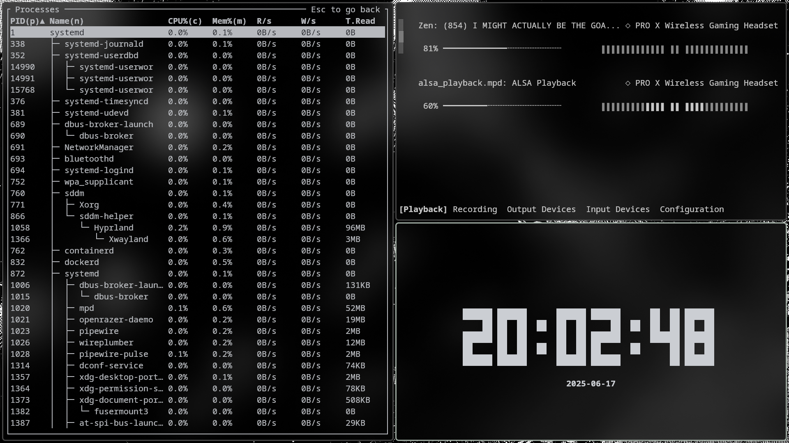
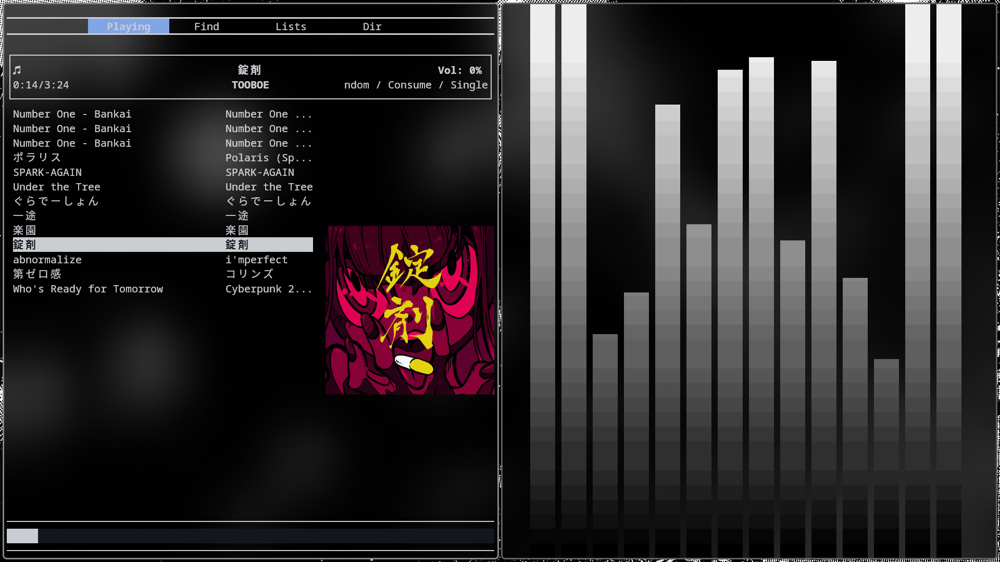

# DotFiles

Welcome to my DotFiles repository! This repository contains configuration files for various tools and applications to customize and enhance my workflow.

## Screenshots

 

## NeoVim

The Neovim configuration was cloned from the [xero/dotfiles](https://github.com/xero/dotfiles) repository.